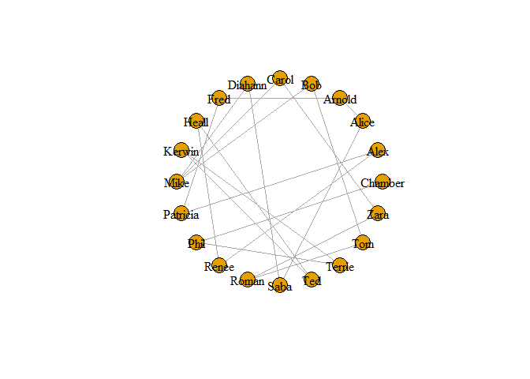
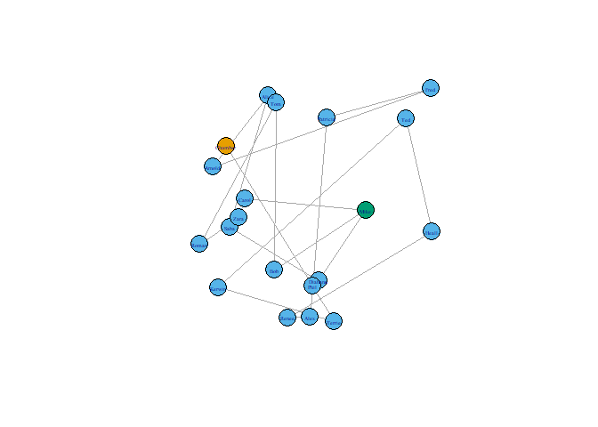

Network-in-R
================
Nima Niarad
7/13/2021

<style> body {text-align: justify} </style>

<!-- Justify text. -->

\*\*Making a Network in R

Sometimes there is a huge network of people in a company. Not just
limited to the company itself but also includes people outside the
company.

You want to find out their connections and know most important persons.
For example, consider a non-profit company that want to know how their
connections can help them to raise more fund.

We can do this in R.

1 - Loading Library…

    ## 
    ## Attaching package: 'dplyr'

    ## The following objects are masked from 'package:stats':
    ## 
    ##     filter, lag

    ## The following objects are masked from 'package:base':
    ## 
    ##     intersect, setdiff, setequal, union

    ## 
    ## Attaching package: 'igraph'

    ## The following objects are masked from 'package:dplyr':
    ## 
    ##     as_data_frame, groups, union

    ## The following objects are masked from 'package:stats':
    ## 
    ##     decompose, spectrum

    ## The following object is masked from 'package:base':
    ## 
    ##     union

2 - Loading the Data…

``` r
BCTA <- read.csv("C:/Nima/Rstudio/Git/Data/BCTA.csv", header=T, as.is=T)
```

3 - First making symmetric matrix:

``` r
d <-BCTA %>%
  dplyr::count(Board,Chamber) %>%
  tidyr::spread(key = Board,value = n)
d[is.na(d)] = 0
mtx <-as.matrix(d)
```

As we see in the environment, it is symmetrical.

4 - Let’s Making a network and plot it:

``` r
ntwork <-graph.adjacency(mtx, mode="undirected", diag=FALSE, weighted=TRUE)

plot(ntwork, vertex.label.color = "black", layout = layout_in_circle(ntwork))
```

<!-- -->

It is a nice clean graph but it cannot help us to understand who is more
central to the network.

Mike has more connections than the others but it should not be the whole
story!

``` r
plot(ntwork, layout = layout.random, vertex.label.cex=c(0.4), vertex.color=degree(ntwork)*25)
```

<!-- -->

Now lets’s do some analysis:

``` r
df <- data.frame(deg = degree(ntwork),cls = closeness(ntwork), btw = betweenness(ntwork))
df %>%
  arrange(desc(btw))
```

    ##          deg         cls btw
    ## Arnold     2 0.010638298  90
    ## Fred       2 0.010638298  90
    ## Alice      2 0.010416667  88
    ## Patricia   2 0.010416667  88
    ## Alex       2 0.010000000  84
    ## Saba       2 0.010000000  84
    ## Diahann    2 0.009433962  78
    ## Renee      2 0.009433962  78
    ## Mike       3 0.008771930  72
    ## Heall      2 0.008771930  70
    ## Ted        2 0.008064516  60
    ## Kerwin     2 0.007352941  48
    ## Terrie     2 0.006666667  34
    ## Bob        2 0.007812500  23
    ## Carol      2 0.007812500  23
    ## Phil       2 0.006024096  18
    ## Tom        2 0.007042254   9
    ## Zara       2 0.007042254   9
    ## Roman      2 0.006410256   2
    ## Chamber    1 0.005434783   0

Node Mike has the highest degree of centrality. It is connected to three
other nodes in the network, more than any other node.

However, closeness and betweenness are telling a different story. The
first two on the top have 2 degrees! It is proved we cannot decide the
centrality just by degree. Let’s see the betweenness separately to find
out

who the persons are:

If we look at just betweenness, we can find out who has the highest
betweenness:

``` r
betweenness(ntwork)
```

    ##  Chamber     Alex    Alice   Arnold      Bob    Carol  Diahann     Fred 
    ##        0       84       88       90       23       23       78       90 
    ##    Heall   Kerwin     Mike Patricia     Phil    Renee    Roman     Saba 
    ##       70       48       72       88       18       78        2       84 
    ##      Ted   Terrie      Tom     Zara 
    ##       60       34        9        9

Arnold and Fred are the nodes that control the flow of information in
the network.

This is the path that most other ones have to go through these two to
reach other ones. So, those are our guys!
